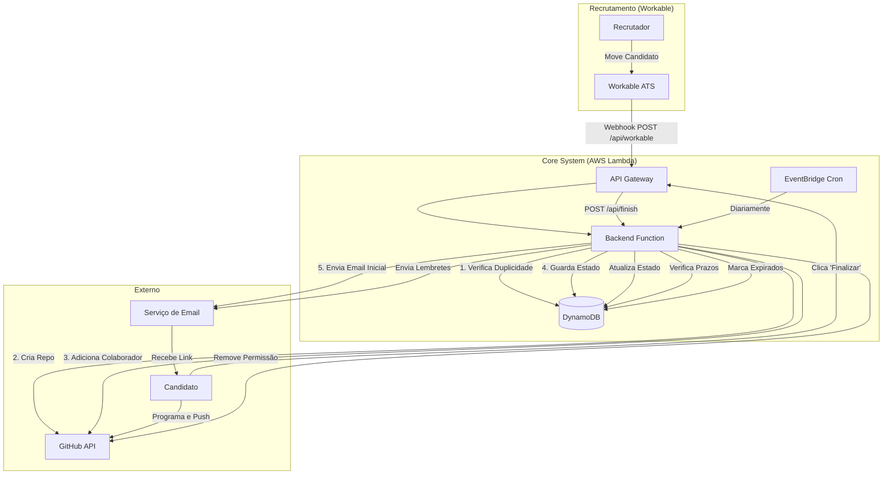

# Interview Automation

Bem-vindo à documentação do projeto **Interview Automation**.

Este sistema automatiza o processo de envio, acompanhamento e avaliação de testes técnicos para candidatos, integrando o Workable, GitHub e notificações por email.

## 🚀 Funcionalidades Principais

- **Integração com Workable**: Deteta automaticamente quando um candidato avança para a fase de teste.
- **Criação Automática de Repositórios**: Cria um repositório privado no GitHub para cada candidato a partir de um template.
- **Gestão de Acesso**: Adiciona o candidato como colaborador e remove o acesso após a conclusão.
- **Notificações Automáticas**: Envia emails com instruções, tokens de acesso e lembretes.
- **Agendamento Inteligente**: Monitoriza prazos e envia lembretes ou marca testes como expirados.

## 🛠 Tecnologias

O projeto é construído sobre uma stack moderna e serverless:

- **Node.js & TypeScript**: Backend robusto e tipado.
- **AWS Lambda**: Execução serverless de baixo custo.
- **DynamoDB**: Base de dados NoSQL para estado dos testes.
- **GitHub API**: Automação de repositórios.

---

## 🏗 Arquitetura do Sistema

O Interview Automation funciona como uma ponte inteligente entre o sistema de RH (Workable) e a plataforma de código (GitHub).

### Diagrama de Fluxo



### Componentes

#### 1. Webhook Handler (`/api/workable`)
O ponto de entrada principal. Recebe dados do Workable, valida as informações do candidato e inicia o processo de provisionamento do teste.

#### 2. Gestor de Repositórios
Utiliza a API do GitHub (Octokit) para:
- Clonar repositórios de template (ex: `backend-exercise-template`).
- Criar novos repositórios privados nomeados como `[tipo]-[utilizador]-[data]`.
- Gerir permissões de colaboradores.

#### 3. Scheduler & Cron Jobs
Executado via AWS EventBridge, este componente garante que nenhum teste fique esquecido.
- **Lembretes**: Enviados 3 dias antes do prazo.
- **Expiração**: Testes não entregues em 7 dias são marcados como `expirado`.

#### 4. Base de Dados (DynamoDB)
Armazena o estado de cada exercício.
- **Tabela**: `exercises` (ou configurável via env)
- **Chave**: `repoName`
- **Dados**: Estado, Token, Datas, Emails.

---

## 🚀 Guia de Deploy

Como implantar e configurar o projeto na AWS.

### Pré-requisitos

- Conta AWS com permissões de administrador (ou acesso a Lambda, IAM, DynamoDB, EventBridge).
- AWS CLI configurado localmente.
- Node.js e NPM instalados.

### Configuração de Ambiente

Crie as seguintes variáveis de ambiente na configuração da sua função Lambda:

| Variável | Descrição | Exemplo |
|---|---|---|
| `COMPANY_ACCOUNT_NAME` | Nome da conta/org no GitHub | `Mindera` |
| `COMPANY_GITHUB_PAT` | Token de acesso pessoal do GitHub (Repo scope) | `ghp_...` |
| `DYNAMODB_TABLE` | Nome da tabela DynamoDB | `exercises` |
| `GMAIL_USER` | Email do remetente (Gmail) | `user@gmail.com` |
| `GMAIL_APP_PASSWORD` | Senha de App do Gmail | `abcd 1234 ...` |
| `EMAIL_SENDER_NAME` | Nome de exibição do remetente | `Interview Automation / Mindera` |
| `GITHUB_CLIENT_ID` | Client ID do OAuth App (GitHub) | `Iv1...` |
| `GITHUB_CLIENT_SECRET` | Client Secret do OAuth App (GitHub) | `e9b...` |
| `BACKEND_URL` | URL base do backend (para links) | `https://tcenhh4rtmrl5iedwl3avrdhzy0ejxqw.lambda-url.eu-west-2.on.aws` |
| `TOKEN_SECRET` | Token de segurança para autenticação | `bea0be0c10d7f80d` |
| `GET_MEMBERS_URL` | URL para obter membros do Workable | `https://tcenhh4rtmrl5iedwl3avrdhzy0ejxqw.lambda-url.eu-west-2.on.aws/v1/members` |

### Script de Deploy Automático

O projeto inclui o script `deploy-express-lambda.sh` para facilitar o processo.

```bash
# 1. Exporte as credenciais e região (se ainda não estiverem configuradas)
export AWS_PROFILE=MinderaLabsShowcasePipeline-102229435459-new-1_assumed
export AWS_REGION=eu-west-2

# 2. Dê permissão de execução (apenas na primeira vez)
chmod +x deploy-express-lambda.sh

# 3. Execute o deploy apontando para a pasta do backend
./deploy-express-lambda.sh backend
```

#### O que faz o script?
1. Instala dependências e compila o TypeScript.
2. Remove dependências de desenvolvimento para otimizar o tamanho.
3. Cria um pacote `.zip`.
4. Usa a AWS CLI para criar ou atualizar a função Lambda.
5. Configura a Function URL para acesso público (ou restrito, conforme configuração).
6. Configura o EventBridge para executar o cron job diariamente.

### Deploy Manual (Alternativo)

Se preferir não usar o script:
1. Execute `npm run build`.
2. Copie `package.json` e `node_modules` (apenas prod) para a pasta `dist`.
3. Comprima o conteúdo da pasta `dist` num ficheiro zip.
4. Faça upload do zip na consola da AWS Lambda.

---

## 📖 Guias de Uso

Tutoriais passo-a-passo para as operações mais comuns.

### Para Recrutadores

#### Como enviar um teste para um candidato

1. Aceda ao **Workable**.
2. Vá para o perfil do candidato.
3. Mova o candidato para o estágio **"Exercise sent"**.
4. **Aguarde**: O sistema irá automaticamente:
    - Criar o repositório no GitHub.
    - Enviar o email com o link para o candidato.
5. Confirme que não recebeu nenhum email de erro e verifique o repositório do github (o repositório deverá ter como nome o user do github do candidato + a data do dia, deverá de ter um template consoante o exercicio a que o mesmo foi atribuido, e o user deverá ter sido convidado como colaboprador do mesmo repositório).

#### O que fazer se o candidato não receber o email?
- Verifique se o email do candidato está correto no Workable.
- Verifique se o GitHub Username foi preenchido corretamente nas perguntas de triagem.
- Caso falte algum campo ou haja um erro durante o processo de criação do repositório, o recrutador deverá receber um email a informar.


### Para Programadores (Manutenção)

#### Como adicionar um novo tipo de teste

1. Crie um novo template de repositório no GitHub (ex: `frontend-exercise-template`).
2. No código (`backend/src/dictionaries/exerciseType.ts`), adicione o mapeamento:

```typescript
import { getRepos } from '../services/repos/getRepos';

export async function roleToExercise(role: string): Promise<string> {
    const exercises = await getRepos();

    const roleToExercise : { [key: string]: string } = {
        "Internship School Testing": exercises[0], // ou mapeie pelo nome específico
        "Frontend Developer": "frontend-exercise-template",
    }

    return roleToExercise[role];
}
```
3. Faça o deploy da nova versão do backend.

#### Como executar localmente para testes

Para executar o backend localmente e testar as integrações:

```bash
# 1. Entre na pasta do backend
cd backend

# 2. Exporte as credenciais e região da AWS
export AWS_PROFILE=MinderaLabsShowcasePipeline-102229435459-new-1_assumed
export AWS_REGION=eu-west-2

# 3. Verifique as credenciais e conecte à conta
# Este script faz o login SSO, assume a role correta e verifica se a tabela DynamoDB existe.
./aws_deploy.sh

# 4. Inicie o servidor em modo de desenvolvimento
npm run dev
```

O servidor iniciará em `http://localhost:3000`. Pode usar o Postman ou Insomnia para enviar um POST para `http://localhost:3000/api/workable/webhook` simulando o payload do Workable.

#### Testes com Bruno

O projeto já inclui uma coleção do **Bruno** configurada para facilitar os testes manuais.

1. Instale o [Bruno](https://www.usebruno.com/).
2. Abra o Bruno e clique em **Open Collection**.
3. Selecione a pasta `backend/Workable API`.

Verá os seguintes pedidos prontos para uso:

**1. webhook workable (Simular envio do Workable)**
- **Método**: `POST`
- **URL**: `http://localhost:3000/api/workable/webhook`
- **Body**: JSON que simula um candidato movido para "Exercise sent".
  ```json
  {
    "data": {
      "name": "Viana",
      "email": "teste@exemplo.com",
      "stage": "Exercise sent",
      "job": { "title": "Android-Developer" },
      "answers": [
        { "question_key": "github_username", "value": "blabla" }
      ]
    }
  }
  ```

**2. Finish test (Simular candidato a finalizar)**
- **Método**: `GET`
- **URL**: `http://localhost:3000/api/finish/:repoName`
- **Nota**: Substitua `:repoName` pelo nome do repositório criado e adicione o parâmetro `?t=SEU_TOKEN` se necessário (ou desabilite a validação de token no código para testes rápidos).

**3. Test-reminder (Executar Cron Jobs manualmente)**
- **Método**: `POST`
- **URL**: `http://localhost:3000/api/cron/daily-jobs`
- **Descrição**: Força a execução da verificação diária (envio de lembretes e expiração de testes).

---

## 🔌 Referência da API

Detalhes técnicos dos endpoints da API REST.

### Base URL

A URL base depende do deployment (ex: Function URL da AWS Lambda).
`https://<id>.lambda-url.<region>.on.aws`

### Endpoints

#### 1. Workable Webhook

Recebe notificações do Workable.

**POST** `/api/workable/webhook`

**Headers**
| Chave | Valor |
|---|---|
| Content-Type | application/json |

**Body Parameters**
O payload deve seguir o formato de webhook do Workable (candidato movido de estágio).

```json
{
  "data": {
    "name": "João Silva",
    "email": "joao@example.com",
    "stage": "Exercise sent",
    "uploader_id": "recruiter_123",
    "profile_url": "https://workable.com/...",
    "job": { "title": "Backend Developer" },
    "answers": [
      { "question_key": "github_username", "value": "joaosilva" }
    ]
  }
}
```

**Respostas**
- **200 OK**: `{ "ok": true, "repo": "backend-joaosilva-2023-10-10" }`
- **200 OK** (Erro tratado): `{ "error": "missing fields" }` (Workable espera 200 mesmo em erro lógico para não retentar).

#### 2. Finalizar Exercício

Endpoint para o candidato sinalizar conclusão.

**GET** `/api/finish/:repoName`

**Query Parameters**
| Param | Tipo | Descrição |
|---|---|---|
| `t` | string | Token de segurança único do exercício. |

**Exemplo**
`GET /api/finish/backend-joaosilva-2023-10-10?t=abc12345`

**Respostas**
- **200 OK**: Devolve sucesso.
- **404 Not Found**: Exercício não encontrado.
- **500 Internal Server Error**: Falha ao processar.

#### 3. Cron Jobs

Endpoint para execução de tarefas agendadas.

**POST** `/api/cron/daily-jobs`

**Descrição**
Executa a lógica de verificação diária:
1. Envia lembretes (3 dias restantes).
2. Marca exercícios vencidos como expirados.

**Respostas**
- **200 OK**: `{ "success": true, "message": "Scheduled jobs executed successfully" }`

---

## 🧠 Contexto Completo do Projeto

Este documento serve como a "verdade absoluta" sobre o funcionamento do **Interview Automation**. Foi desenhado para explicar a lógica de negócio e as regras do sistema, ideal para fornecer contexto a uma IA ou a um novo programador.

### Objetivo do Sistema
Automatizar 100% do fluxo de envio e recebimento de testes técnicos para candidatos, eliminando o trabalho manual dos recrutadores e garantindo uma experiência padronizada para os candidatos.

### Fluxo de Negócio (Business Logic)

#### 1. Gatilho Inicial (Workable)
- **Evento**: O recrutador move um candidato para a fase **"Exercise sent"** no Workable.
- **Ação**: O Workable envia um Webhook para o nosso backend.
- **Validação**: O sistema verifica se o candidato tem `nome`, `email` e `github_username` (recolhido via formulário de candidatura).

#### 2. Provisionamento (GitHub)
- **Template**: O sistema escolhe um template de repositório baseado na vaga (ex: `backend-exercise-template` para vagas de Backend).
- **Criação**: Cria um **repositório privado** no GitHub da organização.
- **Nomenclatura**: `[tipo]-[github_username]-[data]`.
- **Acesso**: Adiciona o candidato como colaborador com permissão de `push`.

#### 3. Comunicação (Email)
- **Email Inicial**: Envia um email para o candidato contendo:
    - Link do repositório.
    - Prazo de entrega (**7 dias** a partir da criação).
    - Link para finalizar o teste (com um token de segurança único).

#### 4. Ciclo de Vida do Teste
- **Duração**: O candidato tem 7 dias corridos.
- **Lembrete**: Faltando **3 dias** para o prazo, o sistema envia um email de lembrete automático (via Cron Job).
- **Expiração**: Se o candidato não finalizar em 7 dias, o sistema marca o estado como `expirado` na base de dados.

#### 5. Finalização (Ação do Candidato)
- O candidato clica no link de "Finalizar" no email ou no README do repositório.
- O sistema:
    1. Valida o token.
    2. Atualiza o estado para `concluido` ou `concluido-atraso` no DynamoDB.
    3. Remove a permissão de escrita do candidato no repositório.
    4. Notifica o recrutador que o teste foi entregue.

### Componentes Técnicos

#### Backend (Express + Lambda)
- **`src/routes/workable`**: Recebe o webhook.
- **`src/routes/finish`**: Endpoint para o candidato finalizar.
- **`src/routes/cron`**: Endpoint chamado diariamente pelo EventBridge.

#### Base de Dados (DynamoDB)
Armazena o estado do exercício.
- **PK**: `repoName`
- **Atributos**:
    - `status`: `enviado` | `concluido` | `expirado` | `concluido-atraso`
    - `deadline`: Data limite ISO.
    - `token`: Token aleatório para segurança do link de finalização.

#### Infraestrutura (AWS)
- **Lambda**: Executa o código Node.js.
- **EventBridge**: "Despertador" que chama a Lambda todos os dias às 09:00 AM.
- **Function URL**: Expõe a API publicamente para receber o Webhook do Workable.

### Regras de Segurança
- **Tokens**: O link de finalização usa um token aleatório (`crypto.randomBytes`) para impedir que terceiros finalizem o teste.
- **Repo Privado**: O código do candidato não é visível publicamente.
- **Validação de Webhook**: O sistema ignora webhooks que não sejam do estágio correto ou duplicados.
